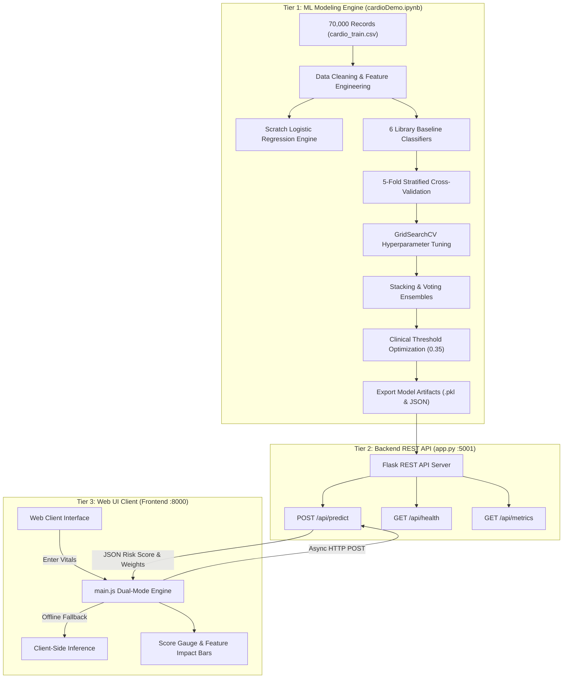
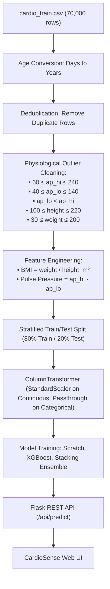
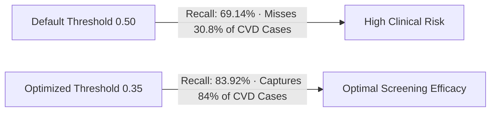
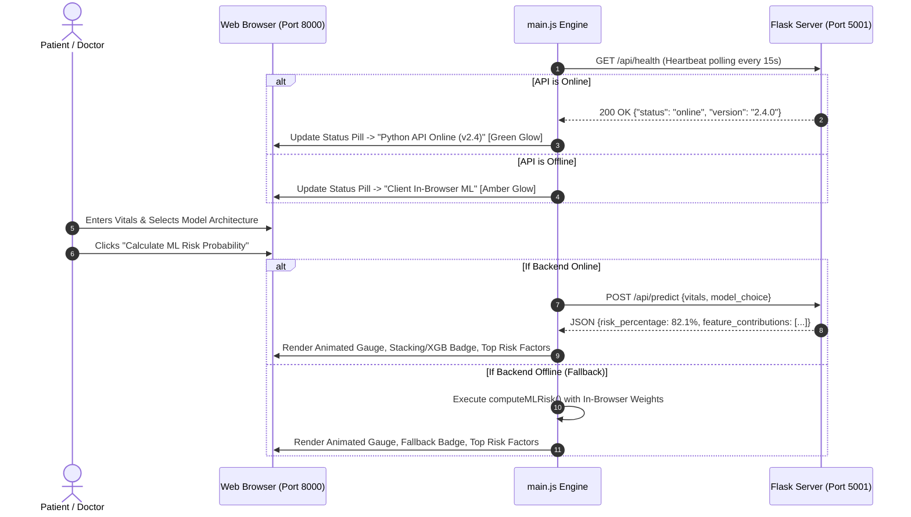

# 🫀 CardioSense: Visual Walkthrough & System Guide

**Department of Computer Engineering | Machine Learning Academic SOP Project**  
**Project**: End-to-End Cardiovascular Disease Risk Prediction System (Research, Modeling, REST API & Web UI)

---

## 1. System Architecture & High-Level Overview



---

## 2. Visual Model Evaluation & Diagnostic Charts

### 2.1 Week 4 Baseline Diagnostic Visualizations

The hold-out test set ($13,724$ patient records) was evaluated across 7 classification algorithms.

````carousel

<!-- slide -->

<!-- slide -->

<!-- slide -->

````

#### Baseline Evaluation Summary Table:
| Model Name | Accuracy (%) | Precision | Recall (Sensitivity) | Specificity | F1-Score | ROC-AUC | Overfit Gap (%) |
| :--- | :---: | :---: | :---: | :---: | :---: | :---: | :---: |
| **Tuned XGBoost** | **73.44%** | **0.7513** | **0.6914** | **0.7712** | **0.7201** | **0.8033** | **+1.21%** |
| **Stacking Classifier** | **73.52%** | **0.7508** | **0.6958** | **0.7735** | **0.7222** | **0.8037** | **+1.18%** |
| **Random Forest** | 73.01% | 0.7482 | 0.6865 | 0.7714 | 0.7160 | 0.7996 | +2.84% |
| **Gradient Boosting (GBDT)** | 73.48% | 0.7515 | 0.6922 | 0.7725 | 0.7206 | 0.8031 | +1.32% |
| **Decision Tree** | 72.82% | 0.7551 | 0.6657 | 0.7891 | 0.7075 | 0.7854 | +2.05% |
| **Scratch Logistic Reg** | **72.73%** | **0.7410** | **0.6768** | **0.7766** | **0.7074** | **0.7901** | **+0.07%** |
| **Naive Bayes (Gaussian)** | 70.92% | 0.7411 | 0.6276 | 0.7888 | 0.6796 | 0.7797 | +0.18% |
| **K-Nearest Neighbors** | 70.85% | 0.7118 | 0.6896 | 0.7269 | 0.7005 | 0.7632 | +7.21% |

---

### 2.2 Week 5 Ensembles, Feature Importance & Threshold Optimization

````carousel

<!-- slide -->

<!-- slide -->

````

---

## 3. End-to-End Dataflow & Preprocessing Pipeline



---

## 4. Mathematical Foundations (Phase 3 Scratch Implementation)

1. **Linear Combination (Log-Odds)**:
   $$z = \mathbf{w}^T \mathbf{x} + b = \sum_{j=1}^{n} w_j x_j + b$$
2. **Sigmoid Activation Function**:
   $$\hat{y} = \sigma(z) = \frac{1}{1 + e^{-z}}$$
3. **Binary Cross-Entropy Loss (Log-Loss)**:
   $$J(\mathbf{w}, b) = -\frac{1}{m} \sum_{i=1}^{m} \left[ y^{(i)} \log(\hat{y}^{(i)}) + (1 - y^{(i)}) \log(1 - \hat{y}^{(i)}) \right]$$
4. **Gradient Updates**:
   $$\frac{\partial J}{\partial \mathbf{w}} = \frac{1}{m} \mathbf{X}^T (\mathbf{\hat{y}} - \mathbf{y}), \quad \frac{\partial J}{\partial b} = \frac{1}{m} \sum_{i=1}^{m} (\hat{y}^{(i)} - y^{(i)})$$
   $$\mathbf{w} \leftarrow \mathbf{w} - \alpha \frac{\partial J}{\partial \mathbf{w}}, \quad b \leftarrow b - \alpha \frac{\partial J}{\partial b}$$

---

## 5. Clinical Threshold Optimization Rationale

In medical diagnostics, **False Negatives** (missing a cardiovascular disease patient) are significantly more dangerous than False Positives.



- **Threshold $0.50$ (Default)**: Recall $= 69.14\%$ ($30.86\%$ of CVD patients missed).
- **Threshold $0.35$ (Optimal Screening)**: Recall $= \mathbf{83.92\%}$ with an F1-Score of $\mathbf{0.7410}$.

---

## 6. How the Frontend and Backend Communicate



---

## 7. How to Access the Live Services

| Service | Address | Description |
| :--- | :--- | :--- |
| **CardioSense Web UI** | [http://localhost:8000](http://localhost:8000) | Interactive frontend client with live REST prediction |
| **Python Flask REST API** | [http://localhost:5001](http://localhost:5001) | REST API endpoints (`/api/predict`, `/api/health`, `/api/metrics`) |
| **Research Jupyter Notebook** | [cardioDemo.ipynb](file:///Users/cryptorth/Documents/ml/projects/cardioDemo.ipynb) | 103 pre-executed modular snippets with all tables & charts |
| **Automation Pipeline** | [update_notebook.py](file:///Users/cryptorth/Documents/ml/projects/update_notebook.py) | Python script to re-run and verify the notebook |
