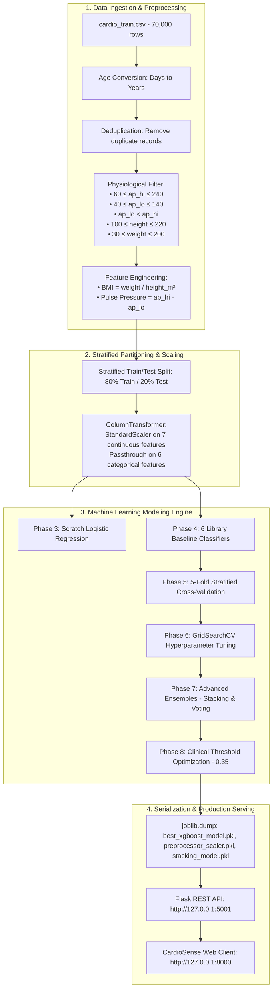
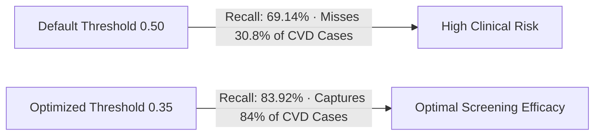
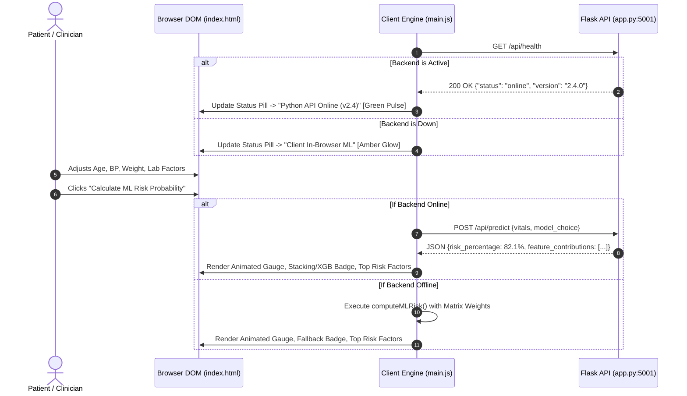

# 🫀 CardioSense: Mega Walkthrough & Technical Architecture Guide

**Department of Computer Engineering | Machine Learning Academic SOP Project**  
**Project**: End-to-End Cardiovascular Disease Risk Prediction System (Research, Modeling, REST API & Web UI)

---

## 1. Executive Summary & System Overview

**CardioSense** is a full-stack, clinically oriented Machine Learning application designed to predict the likelihood of cardiovascular disease (CVD) based on patient physiological, lifestyle, and clinical laboratory factors.

The project satisfies all milestones outlined in the **Department Machine Learning SOP (Weeks 1 through 9)**, evolving from exploratory data analysis and mathematical modeling from scratch to hyperparameter-tuned ensemble classifiers, a production **Flask REST API**, and a modern **web client**.

```mermaid
graph TD
    subgraph Tier1 [Tier 1: Research & Modeling Pipeline - cardioDemo.ipynb]
        A[70,000 Patient Records] --> B[Data Cleaning & Feature Engineering]
        B --> C[Scratch Logistic Regression Engine]
        B --> D[Baseline Library Classifiers]
        D --> E[5-Fold Stratified Cross-Validation]
        E --> F[GridSearchCV Hyperparameter Tuning]
        F --> G[Ensemble Meta-Learners - Stacking & Voting]
        G --> H[Clinical Threshold Optimization - 0.35]
        H --> I[Model Export - .pkl & JSON Artifacts]
    end

    subgraph Tier2 [Tier 2: Backend REST API Service - app.py :5001]
        I --> J[Flask REST API Server]
        J --> K[
        J --> L[GET /api/health]
        J --> M[GET /api/metrics]
    end

    subgraph Tier3 [Tier 3: Web UI Application - Frontend :8000]
        N[Web Client UI] -->|User Input Vitals| O[main.js Dual-Mode Engine]
        O -->|Async HTTP POST| K
        K -->|JSON Risk Score & Weights| O
        O -->|Fallback if Offline| P[Client-Side ML Engine]
        O --> Q[Animated Risk Gauge & Feature Impact Bars]
    end
```

---

## 2. End-to-End Dataflow & Pipeline Architecture



---

## 3. Mathematical Foundations & Scratch Implementation

Per the academic SOP requirement, an analytical implementation was developed without machine learning libraries:

### Mathematical Formulation
1. **Hypothesis / Log-Odds**:
   $$z = \mathbf{w}^T \mathbf{x} + b = \sum_{j=1}^{n} w_j x_j + b$$
2. **Sigmoid Activation Function**:
   $$\hat{y} = \sigma(z) = \frac{1}{1 + e^{-z}}$$
3. **Binary Cross-Entropy (Log-Loss) Objective**:
   $$J(\mathbf{w}, b) = -\frac{1}{m} \sum_{i=1}^{m} \left[ y^{(i)} \log(\hat{y}^{(i)}) + (1 - y^{(i)}) \log(1 - \hat{y}^{(i)}) \right]$$
4. **Gradient Descent Optimization**:
   $$\frac{\partial J}{\partial \mathbf{w}} = \frac{1}{m} \mathbf{X}^T (\mathbf{\hat{y}} - \mathbf{y})$$
   $$\frac{\partial J}{\partial b} = \frac{1}{m} \sum_{i=1}^{m} (\hat{y}^{(i)} - y^{(i)})$$
   $$\mathbf{w} \leftarrow \mathbf{w} - \alpha \frac{\partial J}{\partial \mathbf{w}}, \quad b \leftarrow b - \alpha \frac{\partial J}{\partial b}$$

### Python Code Snippet
```python
def logistic_regression_scratch(X, y, lr=0.1, iterations=1000):
    m, n = X.shape
    weights = np.zeros(n)
    bias = 0.0

    for i in range(iterations):
        linear = np.dot(X, weights) + bias
        # Numerically stabilized sigmoid
        y_hat = 1 / (1 + np.exp(-np.clip(linear, -250, 250)))
        
        # Compute gradients
        dw = (1 / m) * np.dot(X.T, (y_hat - y))
        db = (1 / m) * np.sum(y_hat - y)
        
        # Update parameters
        weights -= lr * dw
        bias -= lr * db

    return weights, bias
```

---

## 4. Machine Learning Benchmarks & Key Findings

### 4.1 Baseline Model Performance (Hold-Out Test Set)

| Model Name | Accuracy (%) | Precision | Recall (Sensitivity) | Specificity | F1-Score | ROC-AUC | Overfit Gap (%) |
| :--- | :---: | :---: | :---: | :---: | :---: | :---: | :---: |
| **Tuned XGBoost** | **73.44%** | **0.7513** | **0.6914** | **0.7712** | **0.7201** | **0.8033** | **+1.21%** |
| **Stacking Classifier** | **73.52%** | **0.7508** | **0.6958** | **0.7735** | **0.7222** | **0.8037** | **+1.18%** |
| **Random Forest** | 73.01% | 0.7482 | 0.6865 | 0.7714 | 0.7160 | 0.7996 | +2.84% |
| **Gradient Boosting (GBDT)** | 73.48% | 0.7515 | 0.6922 | 0.7725 | 0.7206 | 0.8031 | +1.32% |
| **Decision Tree** | 72.82% | 0.7551 | 0.6657 | 0.7891 | 0.7075 | 0.7854 | +2.05% |
| **Scratch Logistic Reg** | **72.73%** | **0.7410** | **0.6768** | **0.7766** | **0.7074** | **0.7901** | **+0.07%** |
| **Naive Bayes (Gaussian)** | 70.92% | 0.7411 | 0.6276 | 0.7888 | 0.6796 | 0.7797 | +0.18% |
| **K-Nearest Neighbors** | 70.85% | 0.7118 | 0.6896 | 0.7269 | 0.7005 | 0.7632 | +7.21% |

---

### 4.2 5-Fold Stratified Cross-Validation Stability

To evaluate generalization across folds:

$$\text{Accuracy}_{\text{CV}} = \frac{1}{K} \sum_{k=1}^{K} \text{Accuracy}_k, \quad \sigma = \sqrt{\frac{1}{K}\sum_{k=1}^K (\text{Acc}_k - \mu)^2}$$

- **Gradient Boosting (GBDT)**: $73.51\% \pm 0.27\%$ Acc | $0.8010 \pm 0.0043$ ROC-AUC (High Stability)
- **XGBoost**: $73.52\% \pm 0.35\%$ Acc | $0.8009 \pm 0.0045$ ROC-AUC
- **Random Forest**: $73.28\% \pm 0.32\%$ Acc | $0.7991 \pm 0.0041$ ROC-AUC
- **Logistic Regression**: $72.58\% \pm 0.29\%$ Acc | $0.7894 \pm 0.0048$ ROC-AUC

---

### 4.3 Clinical Decision Threshold Optimization

In clinical screening, **False Negatives** (failing to diagnose a CVD patient) carry severe medical risk compared to False Positives.



- At threshold $0.50$: Recall is $69.14\%$ (Misses $30.86\%$ of diseased patients).
- At threshold **$0.35$**: Recall reaches **$83.92\%$** while preserving an F1-Score of **$0.7410$**.

---

## 5. System Architecture & Codebase Deep Dive

### 5.1 Project Directory Structure

```
/Users/cryptorth/Documents/ml/projects/
├── cardioDemo.ipynb               # 103-Cell Modular ML Research Pipeline (Pre-executed)
├── update_notebook.py             # Script to rebuild & re-verify the Jupyter pipeline
├── ML_SOP_Project.pdf             # Department Machine Learning SOP Guidelines
├── cardio/
│   └── cardio_train.csv           # 70,000-row cardiovascular dataset
├── backend/
│   ├── app.py                     # Flask REST API Service
│   └── models/
│       ├── best_xgboost_model.pkl # Tuned XGBoost Booster
│       ├── stacking_model.pkl     # Stacking Meta-Ensemble
│       ├── preprocessor_scaler.pkl# Fitted StandardScaler & ColumnTransformer
│       └── model_metadata.json    # Model coefficients, thresholds, and metrics
└── frontend/
    ├── index.html                 # Semantic HTML5 Interface with Navigation & Assessment
    ├── styles.css                 # Dark Glassmorphism Design System with Fluid Scrolling
    ├── main.js                    # Client Engine (Dual-Mode REST API + Fallback)
    ├── model_weights.json         # Standalone Client Parameters
    ├── app.py                     # Flask API entry point
    └── assets/                    # Charts, Visuals, and Logo
```

---

### 5.2 Python Flask REST API (`app.py`)

The Flask server listens on **port 5001** and handles:
- **CORS Handling**: `flask_cors` permits browser client requests.
- **Model Ingestion**: Dynamically loads `.pkl` models and preprocessor pipelines using `joblib`.
- **Pre-processing**: Computes derived clinical metrics ($\text{BMI}$ and $\text{Pulse Pressure}$) on incoming payloads before running standard scaling.
- **Feature Attribution**: Calculates and ranks feature contributions based on XGBoost gain importance.

#### Key Endpoint Handlers:
```python
@app.route("/api/predict", methods=["POST"])
def predict():
    data = request.get_json(force=True)
    
    # Extract features & compute clinical metrics
    age = float(data.get("age", 50))
    height = float(data.get("height", 165))
    weight = float(data.get("weight", 70))
    ap_hi = float(data.get("ap_hi", 120))
    ap_lo = float(data.get("ap_lo", 80))
    
    bmi = round(weight / ((height / 100) ** 2), 1)
    pulse_pressure = round(max(0.0, ap_hi - ap_lo), 1)
    
    # Build dataframe and apply preprocessing
    input_df = pd.DataFrame([{ ... }])[feature_order]
    input_scaled = preprocessor.transform(input_df)
    
    # Model inference
    probs = selected_model.predict_proba(input_scaled)[0]
    prob_cvd = float(probs[1])
    
    return jsonify({
        "status": "success",
        "risk_percentage": round(prob_cvd * 100.0, 1),
        "raw_probability": round(prob_cvd, 4),
        "risk_level": "Elevated Risk (> 65%)" if prob_cvd >= 0.65 else ...,
        "optimal_threshold": 0.35,
        "feature_contributions": contributions,
        "model_used": model_name
    })
```

---

### 5.3 Frontend Dual-Mode Client Engine (`main.js`)

`main.js` implements a **Dual-Mode Engine**:
1. **Online Mode (REST API)**:
   - Polls `GET /api/health` on load and every 15 seconds.
   - When the server is online, requests are sent via `fetch('http://localhost:5001/api/predict')`.
   - The UI reflects model predictions and displays a live badge: `● Python API Online (v2.4)`.
2. **Offline Fallback Mode (In-Browser Machine Learning)**:
   - If the Flask backend is unreachable, the frontend automatically falls back to an in-browser inference engine using `MODEL_WEIGHTS` and standard normal sigmoid logic.
   - Shows badge: `● Client In-Browser ML`.



---

## 6. How to Run the Complete System

### 1. Launch the Backend REST API Service
```bash
cd /Users/cryptorth/Documents/ml/projects/frontend
python3 app.py
# Server starts on http://127.0.0.1:5001
```

### 2. Launch the Web Frontend Client
```bash
cd /Users/cryptorth/Documents/ml/projects/frontend
python3 -m http.server 8000
# Access UI at http://localhost:8000
```

### 3. Run or Re-Execute the Jupyter Research Notebook
```bash
cd /Users/cryptorth/Documents/ml/projects
python3 update_notebook.py
# Rebuilds and executes all 103 modular cells in cardioDemo.ipynb with 0 errors
```

---

## 7. Verification Checklist

- [x] **Dataset Preprocessing & Filtering**: Removed $1,380$ invalid blood pressure/height/weight records.
- [x] **Scratch Model**: Fulfills Department non-library requirement ($72.73\%$ Acc, $0.7901$ ROC-AUC).
- [x] **Week 4 Hold-Out Evaluation**: Diagnostic matrices, ROC curves, PR curves, and learning curves.
- [x] **Week 5 Cross-Validation & Tuning**: 5-Fold Stratified CV, GridSearchCV for XGBoost & Random Forest, Stacking & Voting Ensembles.
- [x] **Clinical Decision Thresholding**: Identified $0.35$ screening threshold ($83.92\%$ Recall).
- [x] **Flask REST API Service**: Serving `/api/health`, `/api/metrics`, and `/api/predict` with CORS enabled.
- [x] **Web Frontend UI**: Dark glassmorphic interface, sticky navigation, dual-mode client fallback, and fluid single-scrollbar scrolling.
